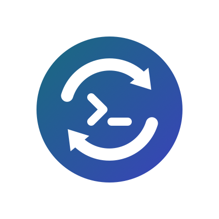
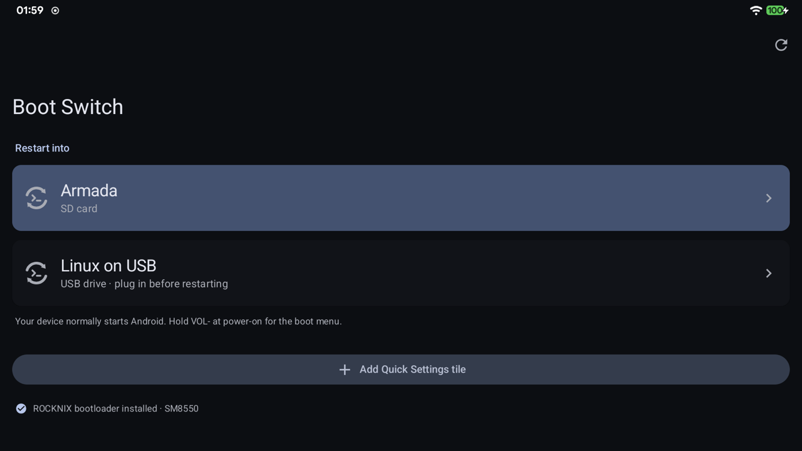
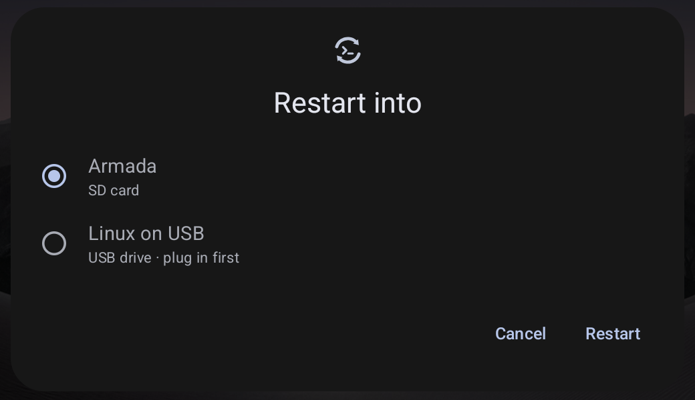
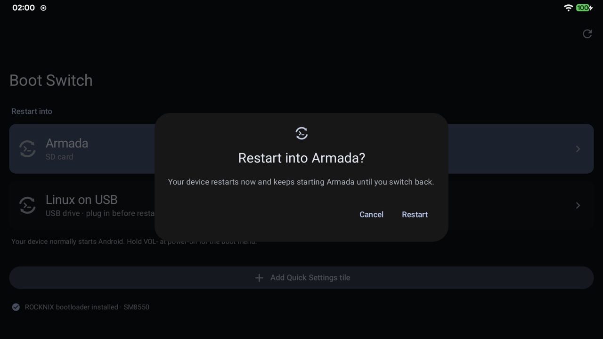
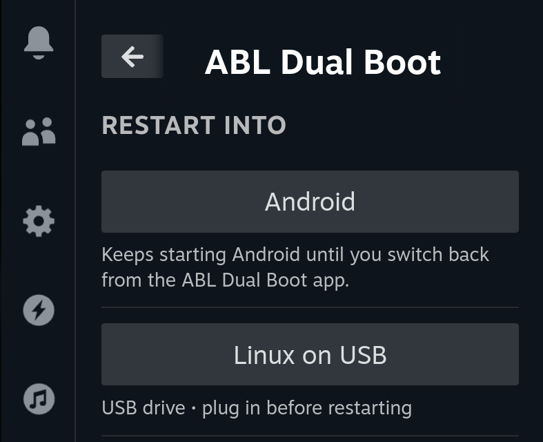

<p align="center"></p>

# ABL Dual Boot

One-tap switching between **Android** and **Linux** on handhelds that use the
[ROCKNIX ABL](https://github.com/ROCKNIX/abl) bootloader. No more holding VOL- at power-on.

Works with any Linux that boots through the ROCKNIX ABL (Armada, ROCKNIX, Batocera, Knulli, …),
from an **SD card or internal storage**, and with every common root solution: **Magisk, KernelSU,
KernelSU Next, SukiSU, APatch**.

<a href="../../releases/latest/download/ABL-Dual-Boot.apk"></a>
<a href="https://apps.obtainium.imranr.dev/redirect?r=obtainium://add/https://github.com/kingsleydon/abl-dualboot"></a>

## Screenshots

| Android app | Quick Settings tile |
|---|---|
|  |  |
| **Confirm** | **Linux (Steam Game Mode, Decky)** |
|  |  |

## Quick start

**1. Android:** install [`ABL-Dual-Boot.apk`](../../releases/latest/download/ABL-Dual-Boot.apk) and open it.
- Allow root when asked (KernelSU / APatch: enable *ABL Dual Boot* in the manager's *Superuser* tab).
- No ROCKNIX ABL yet? Tap **Install ROCKNIX ABL**. Your stock bootloader is backed up first.
- Tap **Add Quick Settings tile**.

**2. Linux:** run once in a terminal (or over SSH):
```sh
curl -fsSL https://github.com/kingsleydon/abl-dualboot/releases/latest/download/install-linux.sh | sudo bash
```

**3. Switch:** pick where to go. ABL Dual Boot finds every Linux system the ROCKNIX ABL can start (internal storage,
SD card, USB) and shows it by name, e.g. **Armada**, **ROCKNIX**, **Batocera**.

| From | Tap |
|---|---|
| Android | Quick Settings tile, or the app → **Restart into** → *Armada · SD card* |
| Linux (Game Mode) | **…** → **ABL Dual Boot** → **Android**, or another Linux system |
| Linux (desktop) | App menu → **Reboot to Android** |

**After an Android system update** the update puts back the stock bootloader and the Linux boot menu
disappears. ABL Dual Boot shows a notification. Tap it, then **Restore**.

## Tested devices

| Device | Chip | Android | Linux | Result |
|---|---|---|---|---|
| AYN Odin 2 Portal | SM8550 | LineageOS 23.2 + KernelSU | Armada 20260926 (SD card) | ✅ Switching both ways |

Tried it on another device? A [device report](../../issues/new?template=device.yml) adds it here.

## Updates

Every part updates the way its platform intends:

| Part | How it updates |
|---|---|
| Android app | Built-in: checks this repo's releases daily and updates through Android's `PackageInstaller`. After you allow *Install unknown apps* once, updates install without prompts (or turn on *Install updates automatically*). You can also track it with [Obtainium](https://github.com/ImranR98/Obtainium). |
| Magisk / KernelSU / APatch modules | Your root manager shows the update (`updateJson`). |
| Decky plugin | Re-run the Linux installer for now; Decky's Plugin Store will handle it once the plugin is listed. |
| Bundled ROCKNIX ABL | A weekly workflow opens a PR when ROCKNIX releases a new ABL, for review and testing. |

Downloads are checked against the SHA-256 digest GitHub publishes for each release file, releases are immutable,
and Android only accepts an update signed with the same key.

## Other downloads

| File | For |
|---|---|
| `abl-dualboot-module-restart-into-linux.zip` | Restart into Linux as a Magisk / KernelSU / APatch module (Modules → Action) |
| `abl-dualboot-module-restore-abl.zip` | Restore the ROCKNIX ABL after Android updates, as a module (Modules → Action) |
| `abl-dualboot-decky.zip` | Decky plugin only (the installer already adds it) |
| `abl-dualboot-linux.zip` | `dualboot.py` + desktop launcher, for manual installs |

Modules update themselves from the manager app (`updateJson`).

> [!WARNING]
> ABL Dual Boot writes to the `devinfo` partition (which also stores bootloader state), and installing the
> ROCKNIX ABL replaces your bootloader. It is tested only on an **AYN Odin 2 Portal (SM8550)** with ROCKNIX ABL v1.2,
> LineageOS 23.2 and Armada. Every tool refuses to write unless the layout matches exactly, verifies every write and
> restores the original on mismatch. The VOL- boot menu always remains as a fallback. Use at your own risk.

## How it works

The ROCKNIX ABL keeps its settings as named entries in `devinfo`. The values below come from the ABL v1.2
binary (LinuxLoader), whose menu code was disassembled to confirm them:

| Setting | Offset | Values |
|---|---|---|
| `BootMode` | `0xA92` | `0` Linux · `1` Android |
| `BootSourceMode` | `0xAF0` | `0` Internal · `1` Auto · `2` USB · `3` SDcard |

ABL Dual Boot does exactly what the menu's **Switch boot mode** does:

- **Linux → Android:** `BootMode=1`, `BootSourceMode` reset to `0`.
- **Android → Linux:** `BootMode=0`. If `BootSourceMode` is `0` and no Linux is installed internally, `BootSourceMode=3` (SD card).
  "Installed internally" means partitions follow `userdata` on the same disk, which is how Armada/ROCKNIX install to internal storage.

ABL Dual Boot lists each place that has Linux (one per location, which is what the ABL supports):
internal storage when partitions follow `userdata`, the SD card when one is inserted, and USB (which can only be
detected at boot). The name comes from the first partition's label (`ARMADA`, `ROCKNIX`, `BATOCERA`, ...).
On the command line: `dualboot.py targets`, then `dualboot.py linux sd|internal|usb`. ROCKNIX ABL builds are recognised by
their `qtestsign` signing certificate (the stock ABL is Qualcomm-signed), so a newer ROCKNIX ABL is never mistaken for stock.

## Build

- `android/`: Kotlin + Jetpack Compose (Material 3), root via [libsu](https://github.com/topjohnwu/libsu). `./gradlew assembleRelease`
- `decky/`: built from [decky-plugin-template](https://github.com/SteamDeckHomebrew/decky-plugin-template). `pnpm i && pnpm build`
- `modules/`: [Magisk module format](https://topjohnwu.github.io/Magisk/guides.html), also understood by KernelSU and APatch
- `shared/`: the device scripts used by both the app and the modules

GitHub Actions builds everything; pushing a `v*` tag publishes a release. The ROCKNIX ABL binaries are not stored
here. CI downloads the official release and checks it against a pinned SHA-256.

## Verify a download

Every release file has a signed build attestation from GitHub Actions:

```sh
gh attestation verify ABL-Dual-Boot.apk -R kingsleydon/abl-dualboot
```

## Contributing

Device reports are the most useful contribution. See [CONTRIBUTING.md](CONTRIBUTING.md).

## License

MIT. ROCKNIX ABL is © the ROCKNIX team under its own terms. The Decky plugin is based on decky-plugin-template (BSD-3-Clause).
